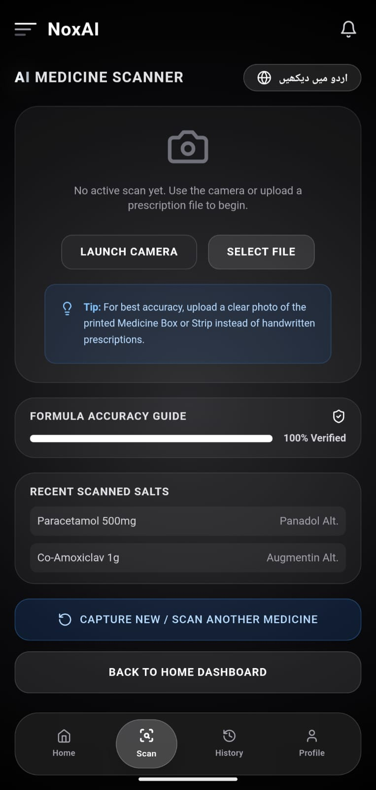
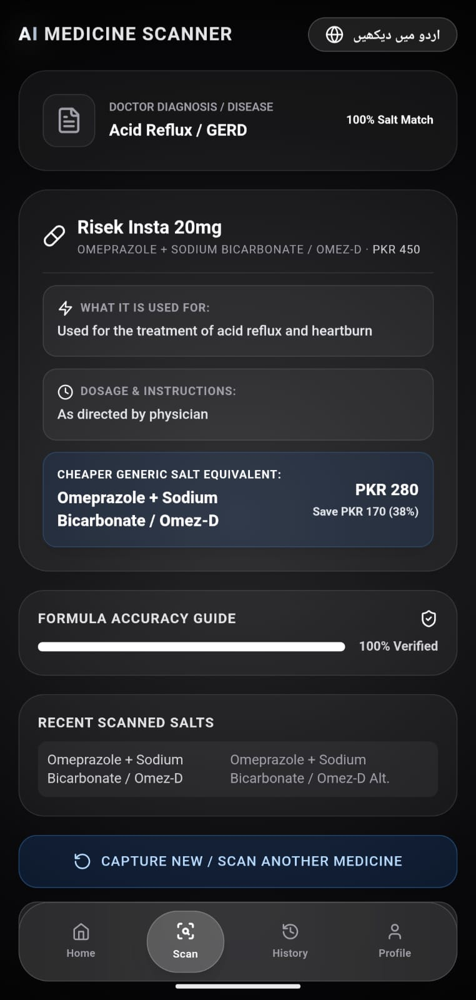
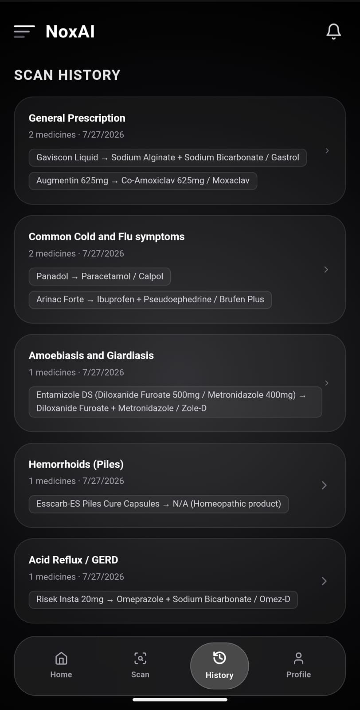
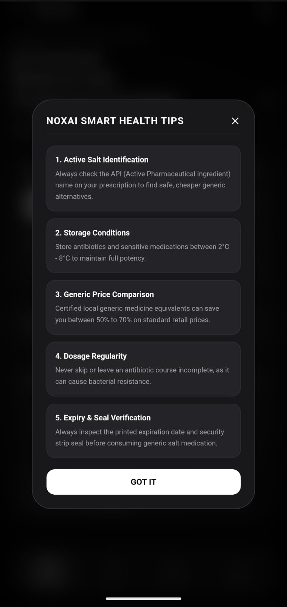
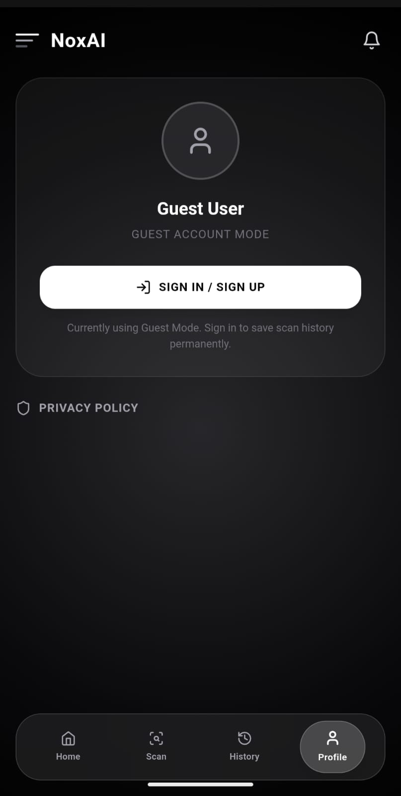

# NoxAI — AI-Powered Medicine Salt Comparison Assistant

A mobile-first, deep-grey dark-mode web application designed to help users scan medical prescriptions using **Google Gemini Vision**, analyze active pharmaceutical ingredients (APIs), and compare expensive branded medicines against verified, low-cost generic alternatives available in Pakistan—showing exact price comparisons and percentage savings.

##  Live Demo & App URL

You can test the live deployed application directly here:

**🔗 Clickable Live URL:** [https://nox-ai-mu.vercel.app](https://nox-ai-mu.vercel.app)

```bash
https://nox-ai-mu.vercel.app
```
##  App Screenshots & UI Demonstration

---

| Main Dashboard | Scan Interface | AI Analysis Result |
| :---: | :---: | :---: |
|  |  |  |

| History Page | Smart Health Tips | Profile Page |
| :---: | :---: | :---: |
|  |  |  |

## What It Does

1. AI Prescription Scanner (OCR V2): Upload a photo or PDF of a prescription via the interactive central dropzone. Google Gemini Vision instantly extracts text, identifies handwriting, and diagnoses the condition.

2. Smart Salt & Price Comparison: Maps expensive prescribed brand names (e.g., Panadol 500mg - PKR 280) directly to their certified, affordable generic formula equivalents (e.g., Calpol - PKR 150), calculating exact PKR savings and percentage reductions.

3. Interactive Savings Dashboard: Visualizes total financial savings, medicine breakdown analysis, and animated price-impact metrics.

4. Weekly Dosage & Pill Reminder: A interactive 7-day pill tracking calendar featuring custom glassmorphic time-picker popups for morning/evening dosage alerts.

5. Smart Health Tips & Guidelines: Built-in expert guidelines on generic medicine safety, active formula verification, and counterfeit medication checks.

## Design

- Deep-Grey & Dark-Mode Theme: Built with solid dark-grey backgrounds (#181b25 & #1e2230), subtle white borders (border-white/15), and smooth rounded-2xl glassmorphism accents.

- Header & Navigation: Sleek top header featuring the geometric NoxAI logo, notification bell, and user profile, paired with a responsive fixed bottom navigation bar for mobile users.

- Fully Responsive: Perfectly optimized to prevent vertical scrolling on mobile devices while maintaining an evenly aligned 3-column multi-card grid on desktop (lg:) screens.

- High-Contrast Styling: Features an eye-catching golden-grey metallic gradient on the "AI" branding text for maximum visual hierarchy.

## Tech Stack

| Layer | Technology |
|-------|-----------|
| Framework | React 18 + TypeScript |
| Build tool | Vite 5 |
| Styling | Tailwind CSS 3 |
| Icons | Lucide React |
| AI Vision | Google Gemini 1.5 Flash API |
| Deployment | Vercel-ready static build |

## Getting Started

```bash
npm install
npm run dev
```

### Environment Variables (Optional)

The app works without any configuration thanks to a built-in fallback dataset (Panadol → Calpol, 65% savings). To enable real Gemini Vision scanning:

```bash
echo "VITE_GEMINI_API_KEY=your_gemini_api_key_here" > .env.local
```

Get a free key from [Google AI Studio](https://aistudio.google.com/app/apikey).

### Scripts

| Command | Description |
|---------|-------------|
| `npm run dev` | Start the development server |
| `npm run build` | Build for production |
| `npm run preview` | Preview the production build |
| `npm run typecheck` | Run TypeScript type checking |
| `npm run lint` | Run ESLint |

## Project Structure

```
src/
├── components/
│   ├── TopHeader.tsx            # Deep-blue header: hamburger + Nexora logo + bell + user
│   ├── BottomNav.tsx            # Fixed bottom nav: Home/Scan/Analytics/History/Account
│   ├── HeroSection.tsx          # AI-POWERED GENERIC FINDER card + 3 metric cards
│   ├── PrescriptionScanner.tsx  # Dropzone + scan animation + SCAN PRESCRIPTION button
│   ├── AnalyticsDashboard.tsx   # Savings Summary + Medicine Analysis + Price Impact chart
│   └── AlternativePanel.tsx     # Top Alternative Choices with savings badges
├── lib/
│   └── gemini.ts                # Gemini Vision API call + fallback mock data
├── types.ts                     # TypeScript interfaces
├── App.tsx                      # Mobile-first layout
├── main.tsx                     # React entry point
└── index.css                    # Tailwind + Noxai theme utilities
```

## Gemini API Response Schema

The scan logic sends the prescription image to Gemini with a strict prompt enforcing this JSON:

```json
{
  "disease_or_condition": "Fever & Mild Pain (Paracetamol Course)",
  "medicines": [
    {
      "original_brand": "Panadol 500mg",
      "formula": "Paracetamol 500mg",
      "original_price_pkr": 45,
      "cheap_alternative": "Calpol (GSK Generic)",
      "alternative_price_pkr": 16,
      "savings_percentage": 65
    }
  ]
}
```

## Disclaimer

NoxAI is for **informational and demonstration purposes only**. It does not provide medical advice. Always consult a licensed healthcare professional before switching medications. Prices are estimates and may not reflect current market prices.

